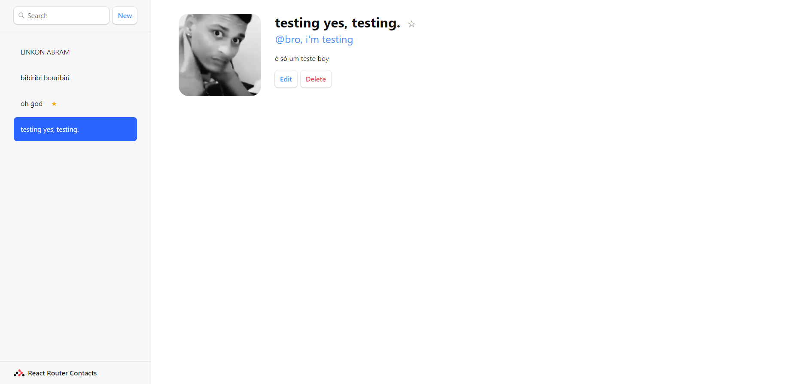

<h1 align="center"> Contact list 💻 </h1>

## Briefing 📄

This is the tutorial app provided by react router docs. It's purpose is to give a solid start on react router features.

> [Tutorial](https://reactrouter.com/en/main/start/tutorial)

> [Acessar](https://rr-contacts.netlify.app)

<h2 align="left"> Objetivo 📌 </h2>

- Improve ReactJs skills.

---

<h3 align="center"> Home 📷 </h3>

<h3 align="center"> Tecnologias utilizadas 🤖 </h3>

> 

